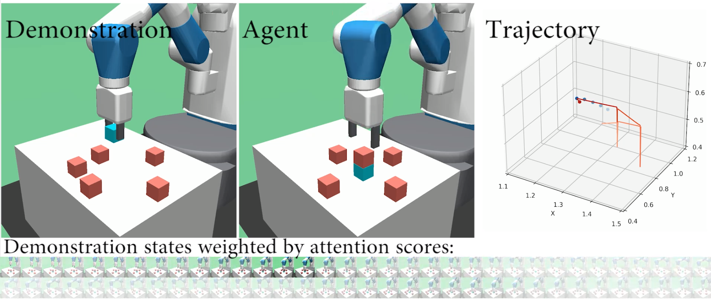
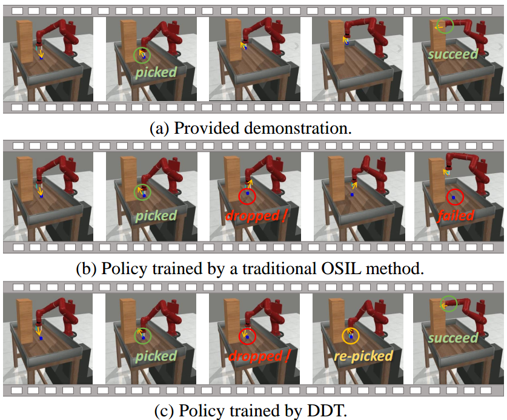

# ICML 2024 Submission - Video Demonstrations

## DDT Method Demonstrations

### DDT-robot-single-tasks, DDT-robot-multi-tasks

- Rollouts generated by our DDT method in a single-task environment and a multi-task environment.
- Demonstrate the adaptive activation of expert states through attention mechanisms.
- Show the method's ability to leverage discrepancies for intelligent decision-making.

## Meta-World Benchmark Demonstrations

### Peg-Insert-Side-v2, Pick-Place-Hole-v2, Shelf-Place-v2, and Sweep-v2

- Rollouts recorded with disturbances added to the Meta-World Benchmark.
- Disturbances include changes in object openness (the first three) and strong gripper position perturbations (the last one).
- Our DDT algorithm overcomes disturbances and successfully completes the task, showcasing its ability to handle unseen states which is almost impossible  for traditional one-shot imitation learning algorithms.
