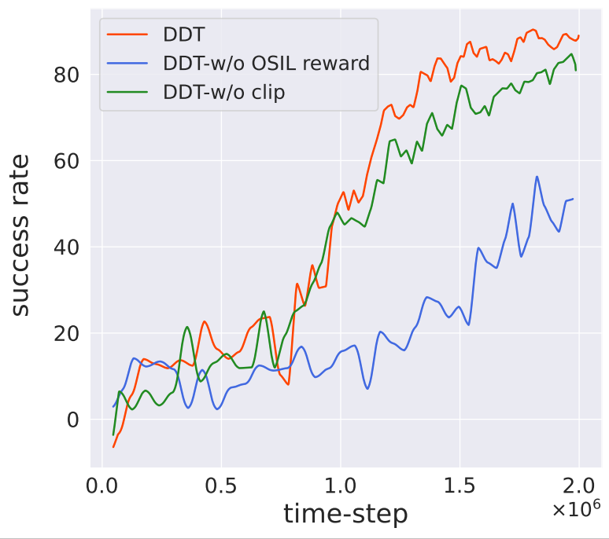
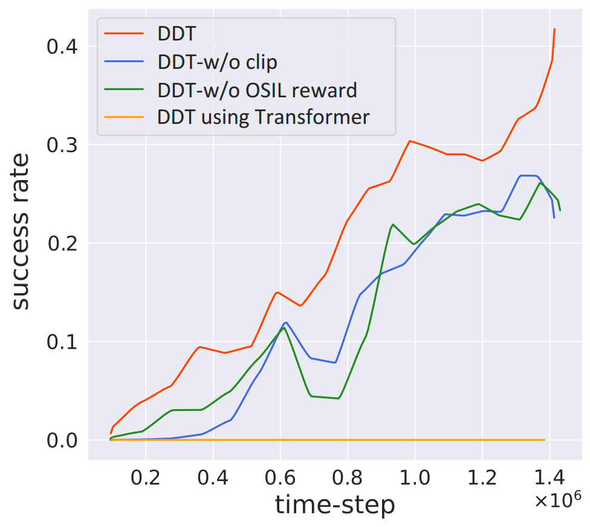

# ICML 2024 Rebuttal - More Proofs

In response to the reviewer's inquiry about the potential effects of altering the proposed OSIL imitation reward function:

$$
R_{OSIL}(s, a) := 1 - \min \left( d(\bar{s}, s)^2  + \frac{d(\bar{a}, a)^2}{\exp(d(\bar{s}, s)^2)}, \eta \right)  +\alpha R_\omega(s, a),
$$ 

we have provided additional evidence to address and alleviate their concerns.

Considering the reward function's design, specifically regarding the clipping term η and the whole imitation reward term that we introduced, we conduct a targeted ablation study on both the demo-navigation and demo-manipulation benchmarks.

## Ablations on demo-navigation environments, tested on unseen maps

## Ablations on demo-manipulation environments, tested on unseen demonstrations

In summary, upon removing these two components, we observed that they primarily influence sample efficiency but do not have a significant impact on policy convergence. However, the imitation reward notably affects early-stage performance.
